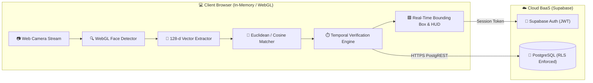

<div align="center">

# ⚡ VEYRA
### *Verified Presence, Simplified.*

[](https://nextjs.org/)
[](https://www.typescriptlang.org/)
[](https://tailwindcss.com/)
[](https://www.khronos.org/webgl/)
[](https://supabase.com/)
[](https://vercel.com/)
[](LICENSE)

<br/>

**A privacy-first, web-native facial biometric attendance platform powered by client-side Deep Metric Learning.**
<br/>
*Zero Python runtimes. Zero video streaming to servers. Instant zero-retraining face verification.*

<br/>

[🚀 Live Demo](https://veyra.vercel.app) • [📖 Documentation](#-documentation-index) • [⚡ Quickstart](#-get-started-in-60-seconds) • [☁️ Deploy to Vercel](#-deploying-veyra-step-by-step)

</div>

---

## 🌟 Why Veyra?

Traditional biometric attendance systems are stuck in 2012: cumbersome desktop Python apps, manual OpenCV installations, and brittle classifiers that require full retraining every time a new student enrolls.

**Veyra reimagines facial attendance from the ground up:**

| Feature | Legacy Desktop Systems (Tkinter/OpenCV) | ⚡ **Veyra** |
| :--- | :--- | :--- |
| **Platform** | Local desktop only (Windows/Linux/Mac) | **Any modern browser on any device** |
| **Video Privacy** | Raw video stream / unencrypted image dumps | **100% In-Browser WebGL** (No video leaves device) |
| **New Enrollment** | Requires retraining 400 epochs on GPU/CPU | **Instant enrollment** via Deep Metric Centroids |
| **False Positives** | Vulnerable to single-frame optical glitches | **Temporal Verification Engine** (Sliding-window filter) |
| **Database** | Plaintext local MongoDB or unencrypted CSVs | **Supabase PostgreSQL** with Row Level Security (RLS) |
| **Duplicates** | Prone to duplicate increments | **Database constraint:** `UNIQUE(session_id, student_id)` |
| **Deployment** | Manual local execution | **One-click Vercel deploy** with automatic HTTPS |

---

## ✨ Core Features

- 👤 **3-Pose Interactive Enrollment Wizard:** Guided multi-sample capture (Frontal $\rightarrow$ Left $\rightarrow$ Right) with automatic real-time quality filters (face dimensions, margins, lighting).
- 🧠 **128-Dimensional Deep Metric Inference:** Quantized FaceNet ResNet-34 model running locally on WebGL 2.0 at 30+ FPS.
- 🛡️ **Temporal Verification Engine:** Multi-frame sliding window accumulator filters momentary flickers and only marks attendance once a face is recognized consistently over consecutive frames.
- 🚫 **Duplicate Attendance Lockout:** Database and in-memory unique constraints guarantee a student cannot be recorded twice in the same session.
- 📊 **Executive Dashboard:** Live metrics, active subjects, daily present/absent ratios, and longitudinal trend analytics.
- 📥 **Instant Audit CSV Export:** One-click real spreadsheet export (`Roll Number, Name, Subject, Date, Status, Confidence`).
- 🌓 **Dark & Light Mode:** Curated HSL color palette with smooth glassmorphism and Lucide icons.
- 🔌 **Offline / Local Demo Mode:** Works out-of-the-box locally even before connecting your Supabase cloud keys.

---

## 🏗️ System Architecture



---

## ⚡ Get Started in 60 Seconds

### Prerequisites
- [Node.js](https://nodejs.org/) v18+ (Node 20+ recommended)
- A laptop/desktop webcam

### 1. Clone the Repository
```bash
git clone https://github.com/DAKSHESHK3/Veyra.git
cd Veyra
```

### 2. Install Dependencies
```bash
npm install
```

### 3. Launch Development Server
```bash
npm run dev
```

Navigate to **[http://localhost:3000](http://localhost:3000)**.
*Veyra starts immediately in local demo mode with sample classes and enrolled students ready to test!*

---

## 🧪 Run Automated Tests

Veyra includes a complete unit test suite for vector distance, centroid calculation, temporal consistency, and CSV formatting:

```bash
# Run Vitest unit tests
npm test

# Run Next.js production build verification
npm run build
```

---

## ☁️ Deploying Veyra Step-by-Step

### 1. Set Up Supabase (Database & Auth)
1. Sign in to [Supabase](https://supabase.com/) and click **"New Project"**.
2. Open the **SQL Editor** in your Supabase dashboard:
   - Run [`supabase/migrations/001_initial_schema.sql`](supabase/migrations/001_initial_schema.sql) *(Creates tables, indexes, and RLS policies)*.
   - Run [`supabase/migrations/002_legacy_seed_migration.sql`](supabase/migrations/002_legacy_seed_migration.sql) *(Optional: seeds starter subjects & students)*.
3. In **Project Settings $\rightarrow$ API**, copy your **Project URL** and **`anon` public key**.

### 2. Push to GitHub
```bash
git remote add origin https://github.com/DAKSHESHK3/Veyra.git
git branch -M main
git push -u origin main
```

### 3. Deploy to Vercel
1. Log in to [Vercel](https://vercel.com/) and click **"Add New..." $\rightarrow$ "Project"**.
2. Import your `Veyra` GitHub repository.
3. In **Environment Variables**, add:
   - `NEXT_PUBLIC_SUPABASE_URL` = *Your Supabase Project URL*
   - `NEXT_PUBLIC_SUPABASE_ANON_KEY` = *Your Supabase Anon Key*
4. Click **"Deploy"**!

> [!TIP]
> Vercel automatically issues an SSL/TLS certificate. **HTTPS is strictly required** by modern browsers for webcam access (`navigator.mediaDevices.getUserMedia`).

---

## 🗺️ Key Application Routes

| Path | Screen | Description |
| :--- | :--- | :--- |
| `/` | **Landing Page** | Product overview, features, security model & FAQ |
| `/login` | **Authentication** | Staff portal with instant 1-click Admin & Teacher demo shortcuts |
| `/dashboard` | **Dashboard** | Total enrolled, today's attendance rate, quick actions, recent logs |
| `/students` | **Student Directory** | Searchable roster with class filtering and profile management |
| `/students/new` | **Enrollment Wizard** | 3-pose interactive camera capture with real-time quality filters |
| `/students/[id]` | **Student Detail** | Profile stats, attendance history, and 128-d embedding status |
| `/subjects` | **Subject Manager** | Dynamic academic courses, class departments, and lecture assignments |
| `/attendance` | **Session Directory** | Historical lecture logs and active camera room directory |
| `/attendance/new` | **Session Setup** | Configure lecture subject, class, and semester before launching |
| `/attendance/[id]` | **Live Camera Room** | Real-time face detection, live bounding boxes, presence counter & timer |
| `/reports` | **Reports & Analytics** | Aggregated attendance logs with real CSV file downloads |
| `/settings` | **Hyperparameters** | Vector distance threshold ($\tau$), temporal consistency frames ($K$) |

---

## 📖 Documentation Index

- [docs/ARCHITECTURE.md](docs/ARCHITECTURE.md) — Comprehensive architectural analysis & legacy comparison.
- [docs/ML_ARCHITECTURE.md](docs/ML_ARCHITECTURE.md) — Mathematical specification of vector embeddings and temporal verification.
- [docs/DATABASE.md](docs/DATABASE.md) — PostgreSQL entity relationships, constraints, and Row Level Security matrix.
- [docs/SETUP.md](docs/SETUP.md) — Local environment configuration guide.
- [docs/DEPLOYMENT.md](docs/DEPLOYMENT.md) — Detailed production cloud deployment walkthrough.
- [docs/SECURITY.md](docs/SECURITY.md) — Threat modeling, credential isolation, and authorization protocols.
- [docs/PRIVACY.md](docs/PRIVACY.md) — Biometric privacy notice, data lifecycle, and user consent.
- [docs/MIGRATION.md](docs/MIGRATION.md) — Automated migration guide for importing legacy MongoDB/CSV datasets.
- [docs/TROUBLESHOOTING.md](docs/TROUBLESHOOTING.md) — Diagnostic guide for camera permissions and lighting.

---

## 🛡️ Security & Privacy Notice

Veyra treats facial biometric data with paramount care:
- **Zero Raw Video Storage:** Web camera feeds are processed in volatile GPU memory and never streamed to any external endpoint.
- **Mathematical Abstraction:** Only unit-normalized 128-float mathematical vectors are persisted. These feature coordinates cannot be reverse-engineered to reconstruct human faces.
- **Role-Based Access Control:** Supabase PostgreSQL Row Level Security (RLS) guarantees that only authorized faculty and administrative accounts can read or audit attendance records.

---

## 🤝 Contributing

Contributions, issues, and feature requests are welcome!
Feel free to check the [issues page](https://github.com/DAKSHESHK3/Veyra/issues).

```bash
# Create your feature branch
git checkout -b feature/AmazingFeature

# Commit your changes
git commit -m 'feat: add AmazingFeature'

# Push to the branch
git push origin feature/AmazingFeature
```

---

## 📄 License

This project is licensed under the MIT License — see the [LICENSE](LICENSE) file for details.

<div align="center">
  <sub>Built with ❤️ by <a href="https://github.com/DAKSHESHK3">DAKSHESHK3</a></sub>
</div>
