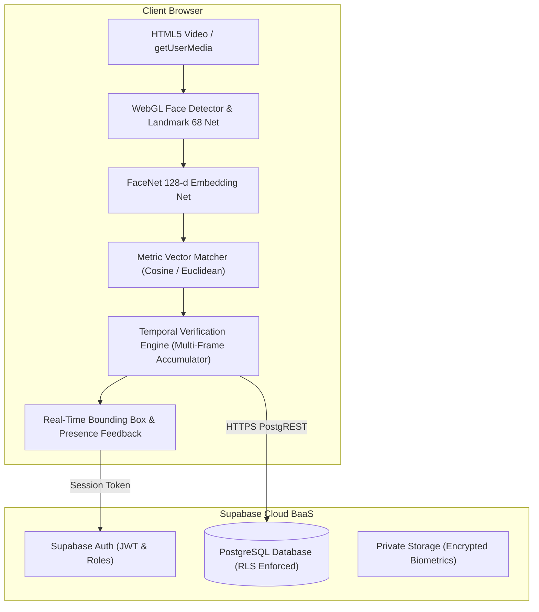

# Smart Attendance System — Modern Web Platform

A production-grade, privacy-first, web-native facial recognition attendance management platform built with Next.js 15, TypeScript, Tailwind CSS, Supabase, and client-side browser Deep Metric Learning.

---

## 1. Overview & Rebuild Motivation

This platform is a complete architectural rebuild of the legacy Python 3 / Tkinter / OpenCV desktop attendance system. 

### Why the legacy system was rebuilt:
- **Desktop & OS Lock-in:** The legacy application required local Python installations, complex OpenCV/C++ builds, and direct OS desktop GUI hooks (`Tkinter`).
- **Retraining Bottleneck:** Enrolling a single new student required running 400 epochs of training on an ad-hoc Softmax MLP classifier (`Face_recognition.MODEL`).
- **Fragile Biometrics:** Old Haar Cascades frequently failed under real-world lighting and head rotations.
- **Security Deficit:** Raw images were stored unencrypted in local folders, database credentials were unprotected, and no role-based authorization existed.

### Modern Rebuilt Solution:
- **100% In-Browser Biometrics:** Face detection, 68-point landmark alignment, and 128-dimensional FaceNet feature extraction execute directly in the browser via WebGL.
- **Zero Raw Video Streaming:** Webcam feeds never leave the user's laptop or desktop.
- **Zero Retraining Required:** Employs Deep Metric Learning vector distance comparison—new students are recognizable immediately upon enrollment.
- **Temporal Verification:** Sliding-window multi-frame validation prevents momentary false positives.
- **Cloud Relational Persistence:** Powered by Supabase PostgreSQL with strict Row Level Security (RLS) policies and unique constraints preventing duplicate attendance.
- **Offline / Local Demo Resilient:** Seamlessly works out-of-the-box locally even before cloud database configuration.

---

## 2. System Architecture



---

## 3. Technology Stack

- **Frontend & App Framework:** Next.js 15 (App Router), TypeScript (strict mode), React 19
- **Styling & UI:** Tailwind CSS, Lucide Icons, Glassmorphism design tokens, CSS variables
- **State & Forms:** React Hook Form, Zod validation
- **Machine Learning & Computer Vision:** `@vladmandic/face-api` (optimized TensorFlow.js WebGL runtime)
- **Database & Auth:** Supabase PostgreSQL with Row Level Security (RLS) & Supabase Auth
- **Testing:** Vitest
- **Deployment:** Vercel

---

## 4. Key Application Routes

| Route | Functionality |
| :--- | :--- |
| `/` | Modern marketing and capabilities landing page |
| `/login` | Staff authentication with demo quick-login shortcuts |
| `/dashboard` | Executive KPIs, attendance rates, recent sessions, quick actions |
| `/attendance` | Historical lecture sessions and active camera room directory |
| `/attendance/new` | Session launcher (select course, class, and semester) |
| `/attendance/[id]` | **Live camera room** with face bounding boxes, session timer, real-time roster, and CSV export |
| `/students` | Student directory with search, filter, and management actions |
| `/students/new` | **3-Pose Interactive Biometric Enrollment Wizard** with quality gates |
| `/students/[id]` | Student profile, statistics, and enrollment status |
| `/subjects` | Dynamic academic courses and class configuration |
| `/reports` | Aggregated analytics, date range filters, and master CSV exports |
| `/settings` | Biometric vector thresholds ($\tau$), temporal parameters, and Supabase status |

---

## 5. Quick Start & Local Setup

### Prerequisites
- Node.js 18+ (Node 20+ recommended)
- Modern web browser (Chrome, Edge, Safari, Firefox)
- Webcam

### 1. Install Dependencies
```bash
npm install
```

### 2. Configure Environment
```bash
cp .env.example .env.local
```

### 3. Run Locally
```bash
npm run dev
```
Navigate to [http://localhost:3000](http://localhost:3000).

### 4. Run Automated Tests
```bash
npm test
```

### 5. Production Build Check
```bash
npm run build
```

---

## 6. Supabase Setup & Migrations

1. Create a project at [supabase.com](https://supabase.com).
2. Go to the **SQL Editor** in your Supabase dashboard.
3. Run `supabase/migrations/001_initial_schema.sql` to create tables, indexes, and RLS policies.
4. Run `supabase/migrations/002_legacy_seed_migration.sql` to seed initial subjects and students.
5. In your project's **API Settings**, copy the `Project URL` and `anon key` into `.env.local`:
   ```env
   NEXT_PUBLIC_SUPABASE_URL=https://<your-project>.supabase.co
   NEXT_PUBLIC_SUPABASE_ANON_KEY=<your-anon-key>
   ```

---

## 7. Database Schema Summary

- **`profiles`:** User roles (`admin`, `teacher`) linked to Supabase Auth.
- **`students`:** Enrolled students with `UNIQUE(roll_number, class_name)`.
- **`subjects`:** Dynamic course catalog with `UNIQUE(code)`.
- **`face_embeddings`:** Unit-normalized 128-float mathematical vectors with `UNIQUE(student_id)`.
- **`attendance_sessions`:** Active and completed lecture sessions.
- **`attendance_records`:** Individual verified attendance records with strict `UNIQUE(session_id, student_id)` constraint preventing duplicate marks.

---

## 8. Documentation Sitemap

- [docs/ARCHITECTURE.md](docs/ARCHITECTURE.md): System architecture and legacy comparison.
- [docs/ML_ARCHITECTURE.md](docs/ML_ARCHITECTURE.md): Mathematical metric learning & temporal verification specification.
- [docs/DATABASE.md](docs/DATABASE.md): PostgreSQL schema, entity relations, and RLS matrix.
- [docs/SETUP.md](docs/SETUP.md): Step-by-step local development setup.
- [docs/DEPLOYMENT.md](docs/DEPLOYMENT.md): Production Vercel deployment guide.
- [docs/SECURITY.md](docs/SECURITY.md): Threat modeling, cryptographic credentials, and authorization.
- [docs/PRIVACY.md](docs/PRIVACY.md): Biometric data privacy and transparency policies.
- [docs/MIGRATION.md](docs/MIGRATION.md): Guide for importing legacy MongoDB and CSV records.
- [docs/TROUBLESHOOTING.md](docs/TROUBLESHOOTING.md): Camera permission, lighting, and database diagnostic steps.

---

## 9. Known Limitations & Future Improvements

- **Extreme Lighting Variations:** As with all optical biometric systems, very low light can degrade face detection; future updates can integrate automatic exposure compensation.
- **Liveness Detection (Anti-Spoofing):** Future enhancements can incorporate blink detection or texture anti-spoofing to prevent photo presentation attacks.
- **Bulk CSV Roster Import:** Adding a CSV uploader for enrolling student batches prior to biometric capture.
