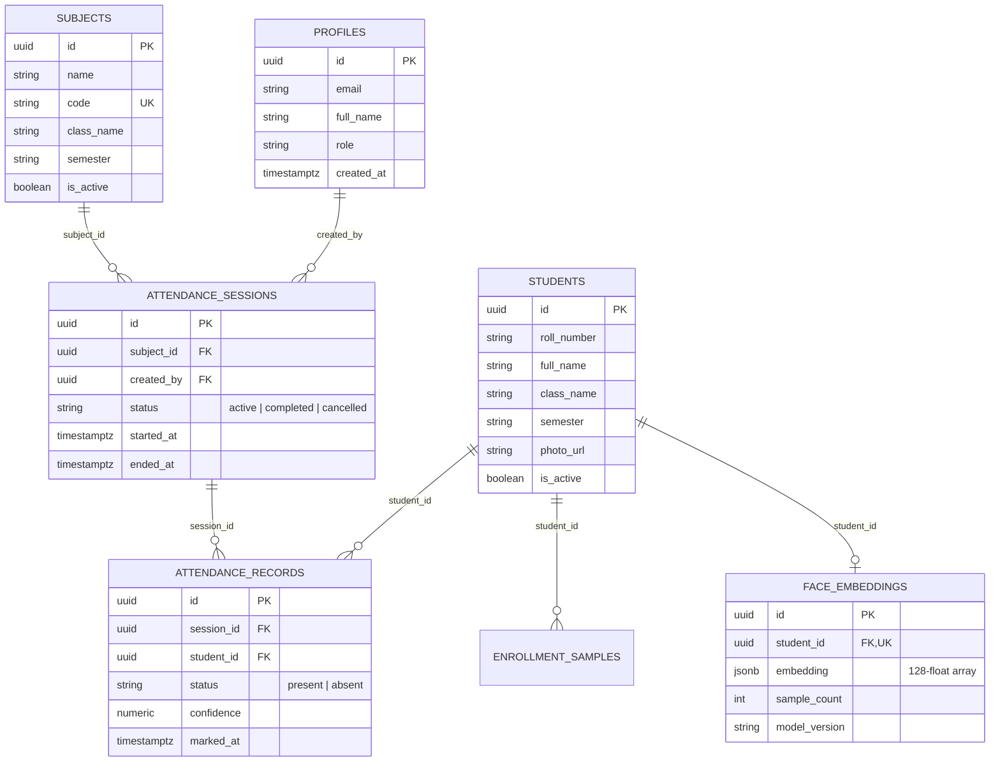

# Database Architecture & Security Model

## 1. Schema Overview

The database is built on **Supabase PostgreSQL** with strict relational integrity, UUID primary keys, and comprehensive Row Level Security (RLS).



---

## 2. Integrity Constraints & Business Logic

1. **Duplicate Roll Numbers:**
   `CONSTRAINT unique_roll_per_class UNIQUE (roll_number, class_name)` guarantees that roll numbers are unique within each class while allowing multiple classes to share numbering.
2. **Duplicate Attendance Prevention:**
   `CONSTRAINT unique_student_per_session UNIQUE (session_id, student_id)` strictly prohibits duplicate attendance entries for any student within the same attendance session at the database layer.
3. **Biometric Embedding Uniqueness:**
   `UNIQUE(student_id)` in `face_embeddings` guarantees a 1:1 relationship between an enrolled student and their canonical centroid feature vector.

---

## 3. Row Level Security (RLS) Policy Matrix

| Table | Operation | Role | Policy Rule |
| :--- | :--- | :--- | :--- |
| `profiles` | SELECT | `admin`, `teacher` | Users see own profile; Admins see all |
| `subjects` | SELECT | `authenticated` | All authenticated staff can browse subjects |
| `subjects` | INSERT/UPDATE/DELETE | `admin` | Only administrators can modify courses |
| `students` | SELECT | `authenticated` | Teachers can view student rosters |
| `students` | ALL | `admin` | Only administrators can enroll/edit/delete students |
| `face_embeddings` | SELECT | `authenticated` | In-memory matcher queries embeddings for session |
| `face_embeddings` | ALL | `admin` | Only administrators can write/update embeddings |
| `attendance_sessions` | ALL | `admin`, `teacher` | Staff can initiate, manage, and close sessions |
| `attendance_records` | ALL | `admin`, `teacher` | Staff can record and audit attendance marks |

---

## 4. Setup in Supabase Dashboard

1. Navigate to the SQL Editor in your Supabase project.
2. Paste the contents of `supabase/migrations/001_initial_schema.sql`.
3. Click **Run**.
4. To create an initial Administrator account:
   - Go to **Authentication > Users** in Supabase.
   - Click **Add User** (e.g. `admin@institution.edu`).
   - Run in SQL Editor:
     ```sql
     UPDATE public.profiles SET role = 'admin' WHERE email = 'admin@institution.edu';
     ```
